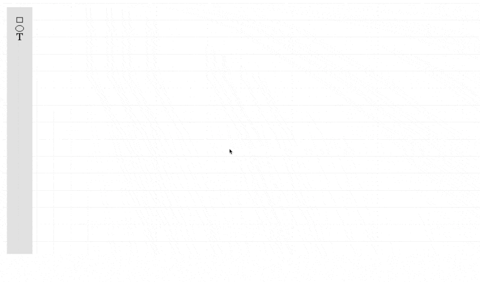

# Draw Entity-Relation App

## Introduction
Draw Entity-Relation App is a web application designed to model entity-relationship diagrams and export them as SQL scripts after validation. Built with React and using the mxGraph library for diagram creation and manipulation, this tool provides an intuitive interface for users to visually design and structure databases.

## Features
- **Interactive Diagram Modeling**: Create and manipulate entity-relationship diagrams with an intuitive drag-and-drop interface.
- **Entity and Attribute Management**: Add entities, define attributes, and establish relationships with ease.
- **JSON Export/Import**: Export validated diagrams to json files, ready for import and recreate.
- **SQL Export**: Export validated diagrams to SQL scripts, ready for database implementation.
- **Responsive UI**: Built with React and Material UI for a modern, responsive user experience.

## Technologies Used
- **React**: JavaScript library for building user interfaces.
- **mxGraph**: JavaScript library for creating and manipulating diagrams.
- **Material UI**: React components for faster and easier web development.
### Development
- **Vitest**: Testing framework for unit tests.
- **Playwright**: Framework for end-to-end testing.
- **GitHub Actions**: Continuous integration and deployment workflows.

## How It Works
1. **Modeling Diagrams**: Use the toolbar to drag entities and relationships onto the canvas. Customize entities by adding attributes and defining relationships between them.
2. **Exporting SQL**: The diagram is validated and then exported to a SQL script, which can be used to create the corresponding database schema.
3. **Exporting and importing the diagram as JSON**: The diagram is validated and then exported to a JSON file that contains the necessary structure to be able to import it and recreate it.

## Continuous Integration and Deployment
The project uses GitHub Actions for continuous integration and deployment. Each commit triggers a pipeline that runs unit and end-to-end tests, ensuring the integrity and reliability of the codebase. Successful builds are automatically deployed to Vercel for both [production](https://draw-entity-relation.vercel.app/) and preview environments.
